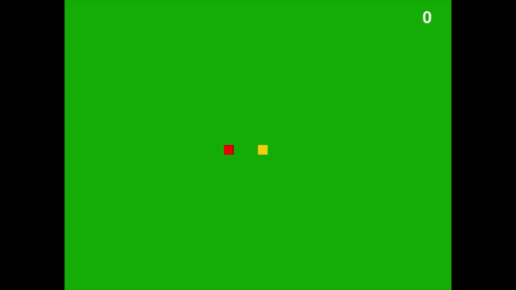

# Read me
* Simple snake game witten in Python using PyGame library. 

# Requirements
* Python 3.4.x or higher
* pygame library
```
pip install pygame
```
# Execution
* Clone or download > Download zip
* Extract folder Snake-Game-master to say, Desktop
* Command prompt:
```
cd Desktop\Snake-Game-master
python snakeGame.py
```
# Preview

#### [click here](https://github.com/SoniaStalance/Snake-Game/blob/master/preview.mp4?raw=true) to preview with sound effects

# Learn more
#### PyGame Documentation:  https://www.pygame.org/docs
